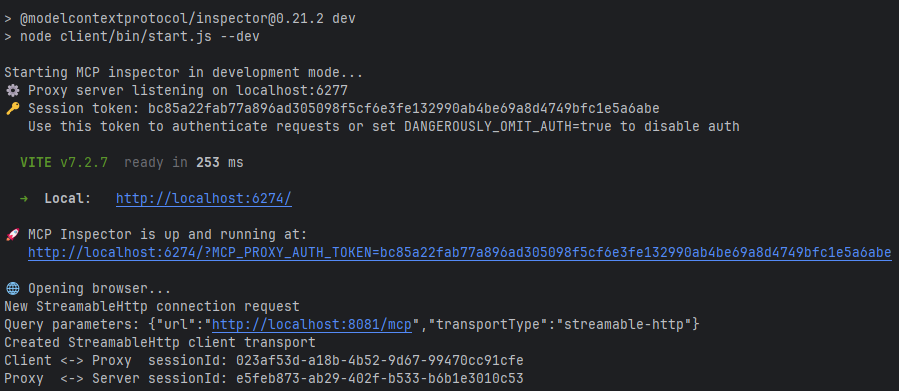
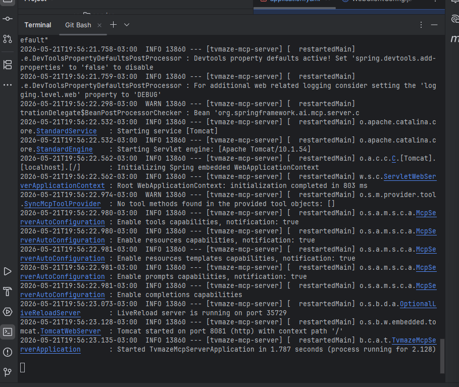
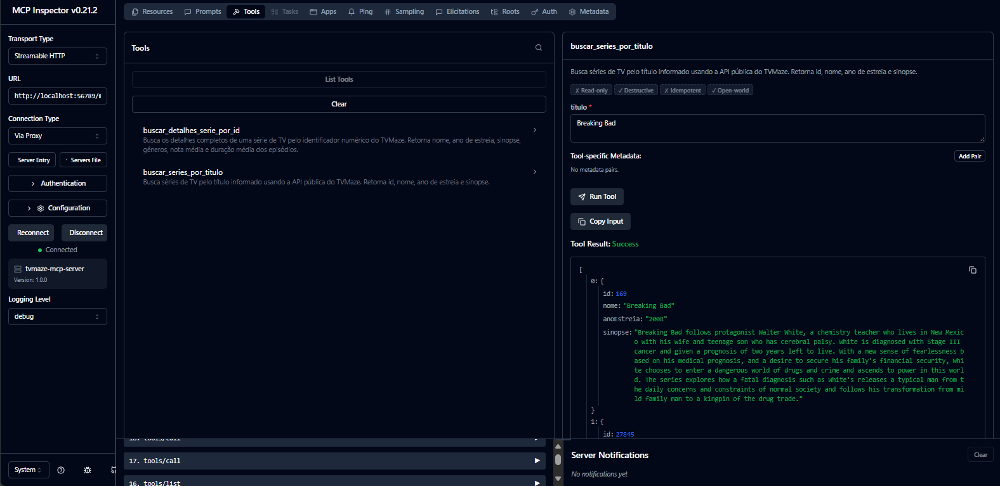
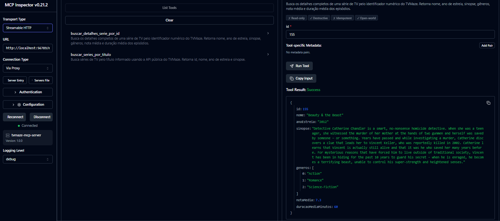

# TVMaze MCP Server

MCP Server desenvolvido com Spring Boot e Spring AI utilizando a API pública do TVMaze.

## 🚀 Tecnologias

- Java 17
- Spring Boot 3
- Spring AI MCP Server
- WebClient
- Maven

## 📌 Funcionalidades

- Buscar séries por título
- Buscar detalhes de uma série por ID
- Integração com MCP Inspector
- Consumo da API pública TVMaze

## 🛠️ Executar projeto

1. Clonar repositório
  * git clone https://github.com/alanerochaa/tvmaze-mcp-server.git
2. Entrar na pasta
  * cd tvmaze-mcp-server
3. Executar aplicação
  * ./mvnw spring-boot:run


### MCP Inspector rodando


### Servidor MCP iniciado


## Servidor disponível em:

* http://localhost:56789/mcp


### 🔎 Tools MCP
* buscar_series_por_titulo

Busca séries pelo título informado.

```
Exemplo:
{
  "titulo": "Breaking Bad"
}
```


* buscar_detalhes_serie_por_id

Busca detalhes completos da série.

```
Exemplo
{
  "id": 155
}
```



### 🌐 API utilizada
TVMaze API:
https://api.tvmaze.com